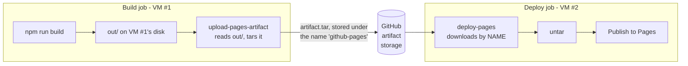
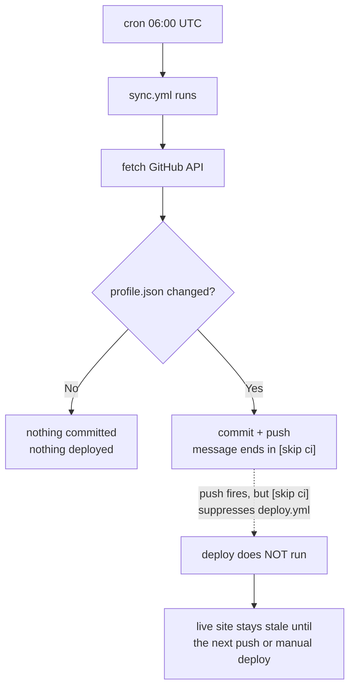

# Deployment & the Build Artifact

A focused reference on **what `deploy.yml` actually produces**, what that artifact is good for,
and the silent couplings that can break a deploy. Companion to `README.md` section 6 (which covers
the pipeline at a high level); this file goes deeper on the artifact itself and the failure modes.

Everything below was verified against the repo as of 2026-09-28.

---

## Contents

1. [What artifact is generated?](#1-what-artifact-is-generated)
2. [`path` vs. artifact name: the read side and the write side](#2-path-vs-artifact-name-the-read-side-and-the-write-side)
3. [Are `sync.yml` and `deploy.yml` sequenced? (no - and the chain is cut on purpose)](#3-are-syncyml-and-deployyml-sequenced-no---and-the-chain-is-cut-on-purpose)
4. [Your local `out/` is irrelevant to the deploy](#4-your-local-out-is-irrelevant-to-the-deploy)
5. [The artifact is the *output*, not the source](#5-the-artifact-is-the-output-not-the-source)
6. [The one fragile coupling: `path: portfolio/out`](#6-the-one-fragile-coupling-path-portfolioout)
7. [The three-way `basePath` coupling (the subtler trap)](#7-the-three-way-basepath-coupling-the-subtler-trap)
8. [Finding: `NEXT_PUBLIC_SITE_URL` is set but never read](#8-finding-next_public_site_url-is-set-but-never-read)
9. [Quick reference: what lives where](#9-quick-reference-what-lives-where)
10. [Mental model, one paragraph](#10-mental-model-one-paragraph)

---

## 1. What artifact is generated?

A **GitHub Pages deployment artifact**: a single `artifact.tar` containing the entire static export
from `portfolio/out/`, uploaded under the fixed name **`github-pages`**.

The chain that produces it:

```
npm run build            next build with output: "export"
     |                    writes plain HTML/CSS/JS to portfolio/out/
     v
portfolio/out/           pre-rendered HTML, /_next/static/* chunks,
     |                    public assets, sitemap - basePath already baked in
     v
actions/upload-pages-artifact@v3     tars the folder -> artifact.tar
     |                                uploaded as workflow artifact "github-pages"
     v
actions/deploy-pages@v4              downloads artifact.tar, publishes to Pages
```

The relevant steps in `.github/workflows/deploy.yml`:

```yaml
- name: Build static site
  working-directory: portfolio
  run: npm run build

- name: Upload Pages artifact
  uses: actions/upload-pages-artifact@v3
  with:
    path: portfolio/out
```

Two jobs, run in order. The `deploy` job has **no `actions/checkout` step** - that is the tell that
it operates purely on the artifact. It never reads your source repository.

---

## 2. `path` vs. artifact name: the read side and the write side

Three questions that tend to arrive together, because they feel like one question.

### Does `portfolio/out` need to exist already?

**No.** Nothing has to pre-exist on the runner except the source code.

The runner starts as a blank, ephemeral VM, and each step creates what the next step needs, in order:

```yaml
- name: Checkout                 # repo source appears on disk
- name: Setup Node.js            # Node is installed
- name: Install dependencies     # node_modules/ created
- name: Build static site        # <- THIS step creates portfolio/out/
- name: Upload Pages artifact    # reads the folder the previous step made
```

`next build` **creates** `out/`; it does not require it. If the folder happens to exist already,
Next deletes it first and writes fresh. What matters is ordering - the upload step runs *after* the
build step, which is why the folder is guaranteed to be there by then.

This is also why your local `out/` is irrelevant (section 4): the runner's `out/` is born and dies
with that single workflow run.

### If it uploads to GitHub storage, why give it `path: portfolio/out`?

Because `path` tells the action where to read **from on the runner's disk** - not where to store
anything.

The action's whole job is "take whatever is at this path, tar it, upload it." It has no way of
knowing what you built or where you put it, so `path` is a **required** input (the action's own
default is `_site/`).

What lands in GitHub's artifact storage is not a folder at all. It is a single tarball filed under
a **name**:

| Concept | Value | Which side it is |
|---|---|---|
| `path` input | `portfolio/out` | a location on the **runner's disk** (read side) |
| artifact **name** | `github-pages` | a key in **GitHub's artifact storage** (write side) |
| stored object | `artifact.tar` (gzip) | the bytes, keyed by that name |

The folder name `out` is not preserved anywhere in storage. It is a one-time "look here" pointer
for a single step, after which the runner is destroyed. The name, by contrast, is load-bearing.

### Does the deploy job read from `out/` automatically?

**No - it cannot. It is a different job on a different VM.**



The two jobs never share a filesystem, and by the time the deploy job starts, VM #1 is already gone.
So `deploy-pages` locates the site by **artifact name**, not by path: it looks for an artifact named
exactly `github-pages`, downloads it, untars it and publishes the contents.

That is why the `deploy` job has no `path`, no `with:` and no checkout:

```yaml
- name: Deploy to GitHub Pages
  id: deployment
  uses: actions/deploy-pages@v4     # <- no inputs at all
```

It needs none, because the artifact name is implied by the Pages contract.

### The name is a contract, not a convenience

Per the action's documentation, if you skip `upload-pages-artifact` and upload your own artifact
instead, it still *"must be named `github-pages`"* and be *"a single gzip archive containing a
single tar file."* Get either wrong and `deploy-pages` finds nothing to deploy.

### Facts about artifact storage

- **Artifacts expire.** `retention-days` defaults to **1**, so you have roughly 24 hours to download
  a run's artifact for inspection (the use case in section 5). After that it is deleted.
- **Size limits.** 10 GB is the hard maximum; the recommended ceiling is 1 GB, which is also the
  size Pages officially supports.
- **No links.** The tar must contain only real files and directories - no symbolic or hard links. A
  static Next.js export satisfies this trivially.

One distinction worth keeping straight: **GitHub Actions** is the runner / CI engine, while
**GitHub Pages** is the static-hosting product. They are separate services that happen to integrate
through this `github-pages` artifact contract.

---

## 3. Are `sync.yml` and `deploy.yml` sequenced? (no - and the chain is cut on purpose)

A natural assumption: the daily sync runs first, fetches fresh data, and *then* the deploy rebuilds
the site with it. The intended order is right, but the wiring that would make it happen is
**deliberately cut**.

### There is no sequencing between them

Neither workflow references the other. No `needs:`, no `workflow_run:` trigger, no shared job graph -
they are two independent workflows fired by completely different events:

| Workflow | Trigger | Defined in |
|---|---|---|
| `sync.yml` | `cron: "0 6 * * *"` (daily 06:00 UTC) + manual `workflow_dispatch` | `.github/workflows/sync.yml` |
| `deploy.yml` | `push` to `main` + manual `workflow_dispatch` | `.github/workflows/deploy.yml` |

So "which runs first" has no fixed answer - it depends entirely on which event fires.

### The chain exists, then `[skip ci]` breaks it

The logic you would expect is genuinely there: sync fetches data, commits `profile.json`, and that
push would trigger `deploy.yml`. But `sync.yml` cuts the last link:

```yaml
git commit -m "chore(data): auto-sync profile from GitHub/LinkedIn [skip ci]"
```

`[skip ci]` is a GitHub Actions convention: a commit whose message contains it does **not** trigger
workflows that would otherwise run on that push. The comment above it says why:

```yaml
# [skip ci] stops this commit from re-triggering the deploy
# pipeline, which would otherwise run on every daily sync.
```

### What actually happens every day



The outcome is the opposite of what the design suggests: **the pipeline that fetches fresh data runs
first, and then nothing rebuilds.** New repos, follower counts and contribution stats land in
`profile.json` on `main` but never reach the live site on their own.

### How the data actually reaches production

1. **You push to `main`** for any reason - a content edit, a typo fix, anything. That push triggers
   `deploy.yml`, which builds from the *current* `main`, picking up however many daily syncs have
   accumulated since the last deploy. This is the normal path.
2. **Manual deploy**: Actions tab -> "Deploy to GitHub Pages" -> Run workflow. Same effect, no
   commit needed.
3. **Manual sync + manual deploy**: run "Auto-sync profile" first, then "Deploy to GitHub Pages".
   Two clicks, fully fresh data now.

### If you want the automatic chain

Remove `[skip ci]` from the commit message in `sync.yml`. Then the chain fires as expected: sync
commits -> push -> deploy rebuilds -> live site updates, once a day.

The tradeoff (also documented in `README.md` section 6, "One caveat to remember"): one extra deploy
per day, but only on days where the numbers actually moved - the `git diff --quiet` guard means no
commit happens when nothing changed, so no deploy either.

The thing to weigh before doing it: it makes the daily sync the thing that publishes your site. If
the GitHub API ever returns garbage (a renamed repo, a deleted avatar), that garbage commits *and*
goes live automatically, with no review step in between. `[skip ci]` is arguably a feature here -
it keeps a deliberate action in the loop before anything reaches production.

---

## 4. Your local `out/` is irrelevant to the deploy

The deployed site is **always rebuilt from source** on a fresh `ubuntu-latest` runner. Nothing in the
workflow uploads your local build output, and it could not even if it wanted to - the root
`.gitignore` excludes it:

```
# Next.js build output
.next/
out/
```

So `portfolio/out/` never enters git, never reaches the runner, and has no influence on what is
published.

**Practical consequences:**

- You cannot "fix" a broken deploy by rebuilding locally. If the live site is wrong, the fix has to
  be a commit to `main` (or a manual `workflow_dispatch` run).
- You can delete your local `out/` and `.next/` folders at any time without affecting anything.
- A clean local build is *reassuring*, not *sufficient*. It proves your machine can build, not that
  GitHub's runner will produce the same output.

The one thing local builds *are* good for: catching environment-specific problems before you push,
since the runner's Node version, env vars and clean install differ from yours.

---

## 5. The artifact is the *output*, not the source

`artifact.tar` is a snapshot of **compiled output**: minified JS in `/_next/static/`, pre-rendered
HTML for every route, asset URLs with the `/Portfolio-Website` prefix already baked in. It contains
no TypeScript, no JSX, no `profile.json` in source form.

### Why you would want it

It is the ground truth for "what is actually live." Your source can look correct while the build
silently produced something different - a stale dependency, a changed env var, a config value that
altered asset paths. Reading the artifact shows you exactly what visitors receive, with no guessing
from source.

### How to get it

1. Open the **Actions** tab in the repo.
2. Click the workflow run you care about.
3. At the bottom of the summary page, under **Artifacts**, download `github-pages`.
4. Untar it:

   ```bash
   tar -xf artifact.tar
   ```

   (On Windows, `tar` is available in PowerShell on Windows 10+; or use 7-Zip / WSL.)

   > Artifacts are deleted after roughly 24 hours (`retention-days` defaults to 1), so download
   > promptly - see section 2.

### What to check once you have it

| Symptom on the live site | What to look for in the artifact |
|---|---|
| No CSS / JS / images loading | Open `index.html`, look at the `/_next/static/...` URLs. They must start with `/Portfolio-Website/`. If the prefix is missing, `basePath` was not active at build time. |
| Old content showing after a push | Compare the HTML text and the chunk hashes in `/_next/static/` against the previous artifact. Identical hashes = the build output did not change, so the problem is upstream of the build. |
| 404s on deep links | Confirm the exported HTML files exist for each route and that `trailingSlash` behavior matches your links. |
| SEO / link previews broken | Check the `<meta>` tags and the absolute `og:image` URL. |

---

## 6. The one fragile coupling: `path: portfolio/out`

`next build` writes the export to a directory chosen by Next config; the workflow **hardcodes** that
same directory. If the two ever disagree, the build fails.

```yaml
- name: Upload Pages artifact
  uses: actions/upload-pages-artifact@v3
  with:
    path: portfolio/out   # <- must match where next build actually wrote the files
```

**Where does Next write it?** `portfolio/next.config.mjs` sets **no `distDir`**, so Next uses its
default. For `output: "export"` that default is `out`:

```js
const nextConfig = {
  reactStrictMode: true,
  output: "export",                        // static export, written to ./out
  basePath: isProd ? `/${repo}` : "",      // "/Portfolio-Website" in production only
  assetPrefix: isProd ? `/${repo}/` : "",
  ...
};
```

So today the coupling is `out` (Next's default) <-> `portfolio/out` (workflow path), and it is
correct. Nothing to fix right now.

**The failure mode if it breaks:** `upload-pages-artifact` fails the step when the path is missing,
so you get a red build rather than a silently bad deploy. The catch is that the error message points
at the *artifact step*, not at your config - which is why this coupling is worth remembering when it
happens. If you ever set `distDir: "export"` (or similar) in `next.config.mjs`, update
`path:` in the same change.

---

## 7. The three-way `basePath` coupling (the subtler trap)

`basePath` and `assetPrefix` in `next.config.mjs` are gated on `NODE_ENV === "production"`:

```js
basePath: isProd ? `/${repo}` : "",
```

That single line means **three separate things must agree on the `/Portfolio-Website` prefix**, and
two of them are implicit:

| # | Where | Prefix present? | Why |
|---|---|---|---|
| 1 | Production build on the GitHub runner | **Yes** | `next build` runs with `NODE_ENV=production` |
| 2 | Your local `npm run dev` | **No** | dev mode is not production |
| 3 | Your local static server (`_work/serve-out.js`) | **Stripped** | it removes `/Portfolio-Website` to match #2's output |

This is why `_work/serve-out.js` contains this line:

```js
// Strip the GitHub Pages basePath when present, since out/ already contains it.
urlPath = urlPath.replace(/^\/Portfolio-Website/, "");
```

The local server exists to serve the *production* export (which has the prefix baked in) at a URL
without the prefix. If you ever change the repo name or the `basePath` logic, that regex needs
updating in lockstep - otherwise every asset request 404s and the site loads unstyled.

**Rule of thumb:** any change to the repo name, `basePath`, or `assetPrefix` requires touching
`next.config.mjs` **and** `_work/serve-out.js` in the same commit.

---

## 8. Finding: `NEXT_PUBLIC_SITE_URL` is set but never read

`deploy.yml` passes this env var into the build:

```yaml
NEXT_PUBLIC_SITE_URL: ${{ vars.NEXT_PUBLIC_SITE_URL || format('https://{0}.github.io/{1}', github.repository_owner, github.event.repository.name) }}
```

The intent is sensible: let a custom domain override the default Pages URL. But **nothing in the app
reads it.** A workspace-wide search for `NEXT_PUBLIC_SITE_URL` finds only two hits, both in config
docs (`deploy.yml` and `README.md`) - zero references in `portfolio/src/`.

The site URL is instead hardcoded in two places:

- `portfolio/src/lib/profile.ts`:
  ```ts
  siteUrl: "https://monarchsharma20502.github.io/Portfolio-Website",
  ```
- `portfolio/src/app/layout.tsx`:
  ```ts
  metadataBase: new URL("https://monarchsharma20502.github.io/Portfolio-Website"),
  ```

So setting the `NEXT_PUBLIC_SITE_URL` repository variable today does **nothing**. The README's
"(Optional) Set the repository variable `NEXT_PUBLIC_SITE_URL` for a custom domain" instruction is
currently misleading.

### Why it matters

`siteUrl` feeds SEO metadata and the Open Graph image URL. In `layout.tsx` there is a comment
explaining a real gotcha:

```ts
// profile.avatar is site-absolute ("/Portfolio-Website/avatar.png"). Next.js
// prepends basePath to relative metadata image URLs and then resolves them
// against metadataBase, which would double the prefix and 404 in link previews.
// A full absolute URL is used verbatim instead.
const avatarUrl = `${profile.siteUrl}${profile.avatar}`;
```

If you ever move to a custom domain, you must update **both** hardcoded URLs or link previews will
point at the old `github.io` address. To make the env var actually work as documented, `profile.ts`
would read `process.env.NEXT_PUBLIC_SITE_URL` with the current value as the fallback - a small,
safe change. (Not done here since you only asked for documentation.)

---

## 9. Quick reference: what lives where

| Thing | Location | Notes |
|---|---|---|
| Workflow definition | `.github/workflows/deploy.yml` | build + deploy, two jobs |
| Next config | `portfolio/next.config.mjs` | `output: "export"`, `basePath` prod-only |
| Export output (local) | `portfolio/out/` | gitignored; never affects the deploy |
| Local static server | `_work/serve-out.js` | strips `/Portfolio-Website`; `node serve-out.js 4322` from `portfolio/out` |
| Site URL (hardcoded) | `portfolio/src/lib/profile.ts`, `portfolio/src/app/layout.tsx` | env var override is currently inert |
| Artifact name | `github-pages` | downloadable from any workflow run summary |

---

## 10. Mental model, one paragraph

A push to `main` triggers `deploy.yml`, which checks out the source on a throwaway Linux VM, runs
`npm ci` and `npm run build`, and gets a fresh `portfolio/out/`. It tars that folder into
`artifact.tar` and uploads it as the `github-pages` artifact. A second job downloads that artifact -
never the source - and publishes its contents to GitHub Pages. Your local `out/` is gitignored and
therefore irrelevant; the artifact is compiled output rather than source, which is exactly why it is
the right thing to inspect when the live site does not match what you expect. The two couplings to
remember are `path: portfolio/out` (must match where Next writes the export) and the three-way
`basePath` agreement between the production build, dev mode, and the local static server.
